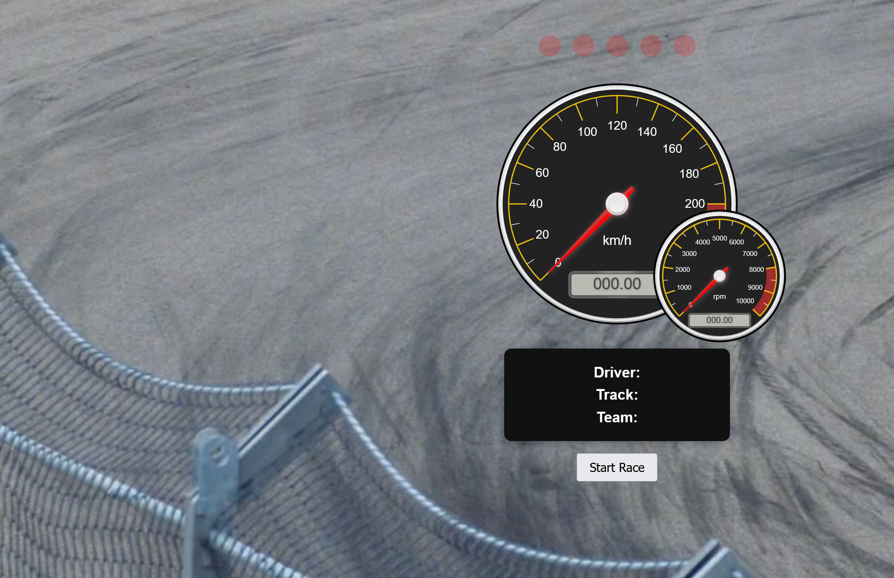

A visually rich, interactive web dashboard that simulates a Formula 1 car's speedometer cluster, complete with animated gauges, warning lights, SVG icons, and a fun tombola feature for randomizing driver, track, and team. This project is ideal for demos, events, or as a UI/UX showcase.

## Features

- **Animated Speedometer & RPM Gauges**: Realistic, interactive dials using [canvas-gauges](https://canvas-gauges.com/).
- **Warning Lights & SVG Icons**: Dynamic display of oil, temperature, engine, and ABS warnings with SVG overlays.
- **Start Sequence**: F1-style start lights and revving/engine audio for immersive experience.
- **Tombola**: Randomly selects a persona (driver), track, and team for each race session.
- **Modern UI**: Responsive, dark-themed interface with video background and styled overlays.
- **No Backend Required**: Runs entirely in your browser—no server or database needed.

## Demo

Open `index.html` in your browser to see the dashboard in action.

 <!-- Add a screenshot if available -->

## Getting Started

### Prerequisites
- A modern web browser (Chrome, Firefox, Edge, Safari)

### Running Locally
1. Clone or download this repository.
2. Open `index.html` in your browser.

> **Note:** All assets (audio, SVGs, video) are included. No build step or server is required.

## Usage
- Click the **Start Race** button to trigger the F1 start sequence, revving sounds, and randomize the tombola.
- Watch the gauges animate and warning icons light up based on random states.
- The tombola will display a random persona, track, and team for each session.

## File Structure

```
├── index.html           # Main HTML file
├── style.css            # Dashboard styles
├── script.js            # Main logic for start sequence and tombola
├── gauge-script.js      # Gauge and icon animation logic
├── speedometer.js       # (Optional) Advanced dashboard rendering
├── *.svg                # SVG icons for dashboard warnings
├── *.mp3, *.mp4         # Audio and video assets
├── strip.png            # Side strip image
├── fraction.min.js      # Utility for gauge calculations
```

## Customization
- **Personas/Tracks/Teams**: Edit the `data` object in `script.js` or `gauge-script.js` to add or change options.
- **Icons**: Replace SVG files to update dashboard warning icons.
- **Audio/Video**: Swap out `background.mp4`, `engine.mp3`, or `revving.mp3` for your own media.

## Credits
- Dashboard logic and UI: [canvas-gauges](https://canvas-gauges.com/)
- SVG icons: Custom and open-source F1-style icons
- Audio: F1 engine and revving samples

## License
MIT License. See [LICENSE](LICENSE) if provided.

---

*This project is for demonstration and educational purposes. Not affiliated with Formula 1 or any official motorsport entity.* 
